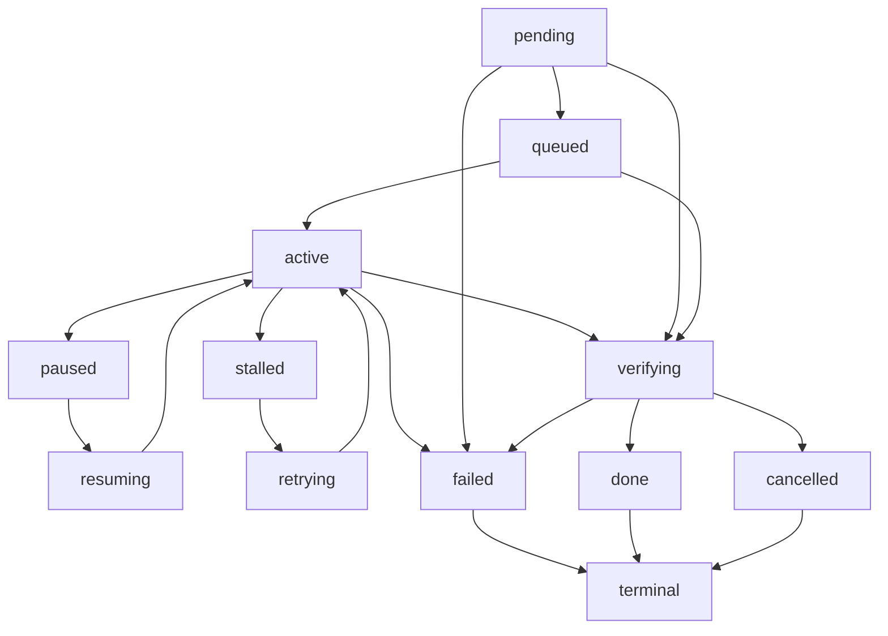

# Chit — Agent Platform for Trading

One product, one agent: a **trading agent** that downloads a data source and scans
it for arbitrage in a single resumable session. The **Chit JIT core** (`chit/`,
Rust + C++ + Python) is the high-performance execution engine, and the
**Continue Protocol** (`src/`) is the agent runtime — an 11-state machine +
file-backed persistence layer for long-running, resumable agents.

An agent is a **session**: it starts, periodically reports progress via
heartbeats, and can be picked back up later — even after a crash — using its
saved checkpoints. A run downloads its source file with a Range-resumable engine,
scans it for arbitrage (within-market and cross-market), and reports — and every
heartbeat is a checkpoint on the same session, so stopping or crashing resumes
from the exact byte or iteration it stopped at.

```
chit/                 JIT compiler core (Rust + C++, Python bindings)
src/                  Continue Protocol runtime (TypeScript API + persistence)
src/agent.ts          the single agent: download -> scan -> report in one session
src/agent/controller.ts  /agent/runs HTTP controller + run registry
src/polyarb/          Polyarb — Polymarket arbitrage engine + bot (used by the agent)
src/downloader.ts     Range-resumable download engine
src/downloadbox.ts    standalone Download Box web UI + worker (optional)
examples/             Runnable example apps on the runtime
```

## Chit JIT core

`chit/` is the vendored execution engine: a JIT compiler in Rust (Cranelift
backend) with a C++ path and Python bindings. In the platform it is the
performance layer — strategy and pricing code written in Python is JIT-compiled
at runtime instead of interpreted, which matters for strategies that evaluate
many markets per tick.

```bash
# Build the JIT core (from the chit/ directory)
cd chit && make all

# Or just the Python bindings
cd chit && pip install -e python/
```

The bot and API do not depend on `chit/` at runtime; they run on plain Node.js.
The JIT core is a drop-in accelerator for strategy code, integrated through the
Python bindings. See `chit/README.md` for the compiler's own documentation.

## Concepts

- **Session** — a unit of resumable work, identified by a UUID.
- **Status** — the lifecycle state machine:



- `pending` — created but not yet queued.
- `queued` — scheduled, waiting for a worker to pick it up.
- `active` — running and receiving heartbeats.
- `paused` — suspended by an operator.
- `resuming` — transient state while waking from pause.
- `stalled` — heartbeat timed out; flagged for intervention.
- `retrying` — a step failed but is eligible for another attempt.
- `verifying` — work complete, post-processing/validation running.
- `done`, `cancelled`, `failed` — terminal; no further transitions allowed.
- **Checkpoint** — each heartbeat/checkpoint appends an immutable snapshot
  (`step`, `progress`, `data`) to the session's history, so work can be resumed
  from the last known position. History is bounded by `MAX_CHECKPOINTS`
  (default 500) so the persisted state stays small.
- **Storage & durability** — sessions are sharded into `dataDir/sessions/<id>.json`
  (one small file per session; a legacy `dataDir/sessions.json` is migrated
  automatically on first write). `put` updates memory immediately and writes are
  coalesced and debounced (`FLUSH_INTERVAL_MS`, default 50) so heartbeats never
  block on disk; `flush()` is awaited for terminal transitions and on graceful
  shutdown. Reads are always served from memory.
- **Watchdog** — marks `active`/`paused`/`resuming`/`retrying` sessions as `stalled`
  when their last heartbeat is older than `STALL_TIMEOUT_MS` (default `60000`).
- **Retry policy** — optional `maxAttempts` per session. Each `retry` increments
  `attempts`; once `attempts >= maxAttempts`, the session transitions to `failed`
  with `error: "max attempts exceeded"`.
- **Webhooks** — optional `webhookUrl` per session. A `transition` event is POSTed
  (best-effort, fire-and-forget) whenever the status changes:
  `{ "event": "transition", "from", "to", "session", "at" }`.
- **Metrics** — `GET /api/metrics` exposes `created`, `transitions`, `fromTo`
  (transition counts), `terminal`, and `current` (live status distribution).
- **Resume from checkpoint** — `resume` accepts `checkpointId` or `step` to rewind
  a session to a specific saved point instead of always continuing from the latest.
- **Pagination** — `GET /api/sessions` supports `limit` (default 20, max 100),
  `offset`, and `cursor` (a session id), returning `pagination.total`/`hasMore`.
- **Auth + tenants** — set `API_KEYS=alice=sk-alice1,bob=sk-bob1` (or bare keys)
  to require `Authorization: Bearer <key>` / `X-API-Key` and namespace sessions
  per tenant. Without `API_KEYS`, the API runs open (`public` tenant).
- **OpenAPI** — a full OpenAPI 3.0 spec at `GET /api/docs` and Swagger UI at
  `GET /api/docs/html`.
- **Docker** — `Dockerfile` + `docker-compose.yml` for a portable deploy.

## Quick start

Everything runs as one app on one port: the Continue Protocol API and the
trading agent.

```bash
npm install
npm run platform    # http://localhost:3001 — one dashboard, one agent
```

State persists to `data/sessions/` (override with `DATA_DIR`); agent downloads
go to `downloads/` (override with `DOWNLOAD_DIR`). Port is `PORT` (default
`3001`); stall timeout is `STALL_TIMEOUT_MS`; write coalescing is
`FLUSH_INTERVAL_MS` (default 50); checkpoint history cap is `MAX_CHECKPOINTS`
(default 500).

The web UI is a single dashboard — no tabs:

- **Run** — paste a data-source URL and start an agent. It downloads the file
  (Range-based resume), scans it for arbitrage, and reports.
- **Progress** — live status, bytes downloaded, current scan iteration,
  opportunities found, and the best return so far.
- **Session** — the whole run is one Continue session; pause it and resume from
  the exact byte or iteration. Every run links to its downloaded file at
  `/files/<name>`.

The same app is also available as separate processes (`npm run dev` = API only,
`npm run downloadbox` = box only) and as one image via `docker compose up`.

## API

Base path: `/api`

### Create a session

```
POST /api/sessions
Content-Type: application/json
Idempotency-Key: <optional, dedupes repeat calls>

{
  "totalSteps": 10,
  "metadata": { "task": "build" },
  "data": { "seed": 42 },
  "maxAttempts": 3,
  "webhookUrl": "https://hooks.example.com/continue"
}
```

`201 Created` on first call, `200 OK` when the same `Idempotency-Key` is reused.

### List / get / health / metrics

```
GET  /api/sessions
GET  /api/sessions?status=done
GET  /api/sessions?limit=20&offset=40
GET  /api/sessions?limit=20&cursor=<session-id>
GET  /api/sessions/:id
GET  /api/health
GET  /api/metrics
GET  /api/docs          # OpenAPI 3.0 spec (JSON)
GET  /api/docs/html     # Swagger UI
```

### Lifecycle endpoints

| Endpoint | Transition | Notes |
| -------- | ---------- | ----- |
| `POST /api/sessions/:id/queue` | `pending -> queued` | Schedule the work |
| `POST /api/sessions/:id/start` | `queued -> active` | Worker picks it up |
| `POST /api/sessions/:id/heartbeat` | -> `active` | Report liveness + progress, records a checkpoint |
| `POST /api/sessions/:id/checkpoint` | -> `active` | Same as heartbeat; explicit resume point |
| `POST /api/sessions/:id/resume` | `paused/stalled -> resuming` | Wake up; body may carry `checkpointId` or `step` to rewind; next heartbeat returns to `active` |
| `POST /api/sessions/:id/retry` | `stalled -> retrying` | Automatic-retry path; heartbeat returns to `active` |
| `POST /api/sessions/:id/pause` | `active -> paused` | Suspend |
| `POST /api/sessions/:id/stall` | -> `stalled` | Manual stall (watchdog does this automatically) |
| `POST /api/sessions/:id/complete` | -> `verifying` | Work done; post-processing begins |
| `POST /api/sessions/:id/finalize` | `verifying -> done` | Validation passed, sets `progress` to 1 |
| `POST /api/sessions/:id/cancel` | -> `cancelled` | Body: `{ "reason" }` |
| `POST /api/sessions/:id/fail` | -> `failed` | Body: `{ "error" }` required |
| `POST /api/watchdog` | -> `stalled` | Manually run the stall watchdog |

### Heartbeat body

```
POST /api/sessions/:id/heartbeat
{ "step": 4, "progress": 0.4, "data": { "cursor": "abc" } }
```

## Trading agent (`/agent`)

The agent is the one product: given a data-source URL it downloads the file
(Range engine), scans it for arbitrage (polyarb engine), and reports — all in a
single Continue session. Each run lives in the platform's run registry and maps
to one session, so interrupting and resuming continues from the exact byte or
iteration.

```
POST /agent/runs                     # start an agent run
GET  /agent/runs                     # list runs (running and finished)
POST /agent/runs/:id/stop            # pause the run (session -> paused, resumable)
GET  /files/<name>                   # the downloaded source file
```

```bash
# Download markets.json, scan 10 iterations (sim), report
curl -s -X POST localhost:3001/agent/runs \
  -H 'Content-Type: application/json' \
  -d '{"sourceUrl":"https://example.com/markets.json","filename":"markets.json","mode":"sim","iterations":10,"intervalMs":500,"minReturn":0.005}'

# Stop mid-run, then resume from the exact iteration using the same session id
curl -s -X POST localhost:3001/agent/runs/<id>/stop
curl -s -X POST localhost:3001/agent/runs \
  -H 'Content-Type: application/json' \
  -d '{"sourceUrl":"https://example.com/markets.json","filename":"markets.json","mode":"sim","iterations":100,"sessionId":"<session-id>","intervalMs":0}'
```

Body fields: `sourceUrl` (required, http(s)), `filename`, `mode` (`sim` default |
`live`), `iterations` (default 10), `intervalMs`, `minReturn` (default 0.005),
`seed`, and `sessionId` to resume an existing run's session.

On iteration 1 the scan uses the downloaded file parsed as a market snapshot
(an array of markets, or `{ data: [...] }` / `{ markets: [...] }`); later
iterations use the simulator (`sim`) or Polymarket's gamma API (`live`).
Opportunities found on each iteration are logged and the session data carries
`opportunities`, `bestReturn`, and the downloaded `file`.

## Error handling

| Status | Meaning |
| ------ | ------- |
| `400` | Bad request body, invalid status filter, missing required field |
| `404` | Unknown session id |
| `409` | Invalid state transition (e.g. heartbeat before `start`) |
| `500` | Internal error |

Errors are JSON: `{ "error": "message" }`.

## Authentication

By default the API is open. To enable tenant isolation, set `API_KEYS` as a
comma-separated list of `name=key` pairs (bare keys map to the `public` tenant):

```bash
API_KEYS="alice=sk-alice-123,bob=sk-bob-456"
```

Authenticate with either header:

```
Authorization: Bearer sk-alice-123
X-API-Key: sk-alice-123
```

Every session is created under the caller's tenant; `list`, `get`, and all action
endpoints only see that tenant. Cross-tenant access returns `404` (existence is
not leaked). `GET /api/health` and `/api/docs*` stay public.

## Docker

The platform (API + trading agent) runs as a single image. The `chit/` JIT core
is not required at runtime.

```bash
docker build -t chit-platform .
docker run -p 3001:3001 -v "$PWD/data:/app/data" \
  -e API_KEYS="alice=sk-alice-123" chit-platform
```

Or with compose:

```bash
API_KEYS="alice=sk-alice-123" docker compose up
```

## Example workflow

```bash
# start work
SESSION=$(curl -s -X POST localhost:3001/api/sessions \
  -H 'Content-Type: application/json' \
  -d '{"totalSteps":5}' | jq -r .session.id)

# schedule and pick up
curl -s -X POST localhost:3001/api/sessions/$SESSION/queue
curl -s -X POST localhost:3001/api/sessions/$SESSION/start

# worker keeps reporting
curl -s -X POST localhost:3001/api/sessions/$SESSION/heartbeat \
  -H 'Content-Type: application/json' -d '{"step":2,"progress":0.4}'

# crash, new worker resumes from last checkpoint
curl -s localhost:3001/api/sessions/$SESSION | jq .session.checkpoints[-1]
curl -s -X POST localhost:3001/api/sessions/$SESSION/resume
curl -s -X POST localhost:3001/api/sessions/$SESSION/heartbeat

# worker stalls; watchdog flags it, retry policy escalates after maxAttempts
curl -s -X POST localhost:3001/api/sessions/$SESSION/retry

# finish: complete (verifying), then finalize (done)
curl -s -X POST localhost:3001/api/sessions/$SESSION/complete
curl -s -X POST localhost:3001/api/sessions/$SESSION/finalize
```

## Download Box (optional, standalone)

`src/downloadbox.ts` is a genuine use of the API, not a demo: a web UI + worker
you run on any wall-powered machine (old laptop, Raspberry Pi, home server) so
your phone never has to do the work. Paste a URL and the box downloads it in the
background — with Range-based resume, so if the machine reboots, the network
drops, or you pause it, the download continues from the exact byte where it
stopped instead of restarting.

It runs standalone on its own port; it is not a platform panel (the platform's
agent downloads files instead):

```bash
# Start the continue API (port 3001)
npm run dev

# In another terminal, start the download box (port 3000)
npm run downloadbox
```

Open the Downloads tab (or http://localhost:3000 standalone) — add a URL, watch
live progress, and use Pause / Resume / Retry / Cancel. Completed files are
served at `/downloads/files/<name>`.

Environment variables: `PORT` (default 3000), `CONTINUE_BASE_URL` (default
`http://127.0.0.1:3001`), `DOWNLOAD_DIR` (default `./downloads`).

```bash
# Simulate an interruption: pause at ~50%, then resume
curl -X POST http://localhost:3000/downloads/jobs \
  -H 'Content-Type: application/json' \
  -d '{"url":"https://example.com/file.iso","filename":"file.iso"}'
# ... wait a bit, then:
curl -X POST http://localhost:3000/downloads/jobs/<id>/pause
curl -X POST http://localhost:3000/downloads/jobs/<id>/resume
```

## Polyarb — Polymarket arbitrage bot

`src/polyarb/` is a real-world bot (not an example) that scans Polymarket
markets for arbitrage. It drives the whole scan from a Continue session, so an
interrupted run resumes from its last checkpoint instead of re-scanning.

Two modes:

- **Simulator** (`--mode sim`): offline, seeded, and deterministic — ideal for
  development and CI. It generates fake correlated markets and injects
  mispricings, so you can watch the detector and executor work without network
  or real money.
- **Live** (`--mode live`): reads real markets from Polymarket's gamma API. A
  live scan reports opportunities but does **not** trade.

Detection runs on every iteration and logs anything above `--min-return`:

- **Within-market**: a binary (or N-outcome) market whose outcome prices sum to
  less than 1 — buying one of each outcome locks a risk-free profit.
- **Cross-market**: the same question listed as separate markets (e.g. Yes and
  No tokens split across two markets with the same event id) where the pair is
  mispriced relative to each other.

```bash
# Sim mode: 8 scan iterations, seeded
npm run polyarb -- --mode sim --iterations 8 --seed 42

# Resume an interrupted scan from its last checkpoint
npm run polyarb -- --mode sim --iterations 30 --session <session-id>

# Live: scan real Polymarket markets (read-only, no orders)
npm run polyarb -- --mode live --iterations 5
```

Every scan is a Continue session. Kill the process mid-run and re-run with the
same `--session` — it continues from the last heartbeat instead of restarting.

On the platform, the agent's scan stage drives the same detection engine. The
controller keeps a live registry of running and finished runs at `/agent/runs`
(see [Trading agent](#trading-agent-agent)); stopping a run pauses its session,
and restarting it with the same `sessionId` continues from the exact iteration
it stopped at.

### Trading (experimental, on by choice)

Executing opportunities requires the Polymarket CLOB and is **off by default**;
the live executor is only touched when you pass `--trade`. It needs the CLOB
credentials as environment variables:

| Variable | Meaning |
|---|---|
| `POLYMARKET_API_KEY` | CLOB API key (from the Polymarket dashboard) |
| `POLYMARKET_SECRET` | CLOB API secret |
| `POLYMARKET_PASSPHRASE` | CLOB API passphrase |
| `POLYMARKET_FUNDER` | Address that funds the orders |
| `POLYMARKET_CHAIN_ID` | Chain id, default `137` (Polygon) |

```bash
POLYMARKET_API_KEY=... POLYMARKET_SECRET=... POLYMARKET_PASSPHRASE=... \
POLYMARKET_FUNDER=0x... npm run polyarb -- --mode live --trade --size 25
```

### Risk disclosures

- **Markets move**: a spread that looks like arbitrage can vanish or invert
  between scan and fill. Slippage and gas are not modeled in the simulator.
- **Execution is not guaranteed**: resting orders on the CLOB may go unfilled;
  the bot places single orders and does not chase or hedge.
- **Checkpointed, not free**: the bot persists its scan progress, not an
  always-on position. Always test in sim mode first and start with the smallest
  sizes.

## Examples

Two runnable example apps in `examples/` show the API in action. Both default to
`http://localhost:3001` (override with `CONTINUE_BASE_URL`) and hot-reload through
the SDK.

### Agent runner (`examples/agent`)

A multi-step LLM agent workflow. Every step generates output that is saved as a
checkpoint; interrupt it, then resume and it continues from the last completed
step instead of restarting. Ships with a deterministic mock LLM — set
`USER_LLM_API_KEY` (+ optional `USER_LLM_BASE_URL`, `USER_LLM_MODEL`) to use a real
OpenAI-compatible endpoint.

```bash
# Run 4 steps, simulated crash after step 2 (session is left paused)
npx tsx examples/agent/runner.ts --task "research brief" --steps 4 --crash-after 2

# Continue that session from its last checkpoint
npx tsx examples/agent/runner.ts --task "research brief" --steps 4 --session <id>
```

### File worker (`examples/fileworker`)

A batch job that transforms every file in a directory into an output directory,
tracking one file per step. Transient failures are recovered through the
`stall -> retry -> active` loop; interrupting it (Ctrl+C via `--max-files`, or a
real SIGINT) pauses the session and resume skips already-processed files.

```bash
# Process a directory, stopping after 1 file to simulate an interruption
npx tsx examples/fileworker/worker.ts --input ./in --output ./out --max-files 1

# Resume the interrupted batch, skipping completed files
npx tsx examples/fileworker/worker.ts --input ./in --output ./out --session <id>

# Inject a one-time failure for a file to watch the retry policy work
npx tsx examples/fileworker/worker.ts --input ./in --output ./out --fail-on b.txt
```

## Client SDK

A typed, dependency-free client (`src/client.ts`) is included:

```ts
import { ContinueClient } from './src/client.js';

const client = new ContinueClient({ baseUrl: 'http://localhost:3001' });

const session = await client.create({ totalSteps: 5, maxAttempts: 3 });
await client.queue(session.id);
await client.start(session.id);
await client.heartbeat(session.id, { step: 2, progress: 0.4 });
await client.pause(session.id);
await client.resume(session.id);
await client.complete(session.id);
await client.finalize(session.id);
```

Every endpoint is a method: `create`, `get`, `list`, `queue`, `start`, `heartbeat`,
`checkpoint`, `resume`, `retry`, `pause`, `stall`, `complete`, `finalize`, `cancel`,
`fail`, `watchdog`, `metrics`, `health`. Pass a custom `fetchImpl` to swap in a
mock transport.

## Development

```bash
npm run platform   # the one app on :3001 — API + trading agent + dashboard
npm run dev        # API-only, tsx watch
npm run downloadbox # box standalone on :3000
npm run polyarb    # polyarb CLI bot
npm test           # vitest + supertest
npm run typecheck  # tsc --noEmit
npm run build      # tsc -> dist/
```

## Project layout

```
chit/              # JIT compiler core (Rust + C++, Python bindings)
src/
  types.ts    # Session, Checkpoint, 11 statuses, inputs
  store.ts    # sharded, coalesced file store (one file per session)
  service.ts  # state machine, watchdog, retry policy, webhooks, metrics, pagination
  routes.ts   # REST router
  app.ts      # express app factory + auth + docs
  server.ts   # API-only entrypoint
  platform.ts # the one app: API + trading agent on one port
  ui.ts       # single dashboard (run agent, progress, sessions)
  agent.ts    # the agent: download -> scan -> report in one Continue session
  agent/controller.ts # /agent/runs controller + run registry
  client.ts   # typed ContinueClient SDK
  auth.ts     # API-key auth middleware + tenant parsing
  openapi.ts  # OpenAPI 3.0 spec
  downloader.ts  # Range-resumable download engine
  downloadbox.ts # standalone web UI + worker (optional)
  polyarb/       # Polymarket arbitrage engine, simulator, live client, executors, bot
examples/
  common.ts          # shared CLI/session helpers
  agent/             # LLM multi-step agent runner (resumable)
  fileworker/        # batch file-processing worker (retry + pause/resume)
test/
  api.test.ts        # API integration tests
  features.test.ts   # retry, webhooks, metrics, client SDK tests
  platform.test.ts   # resume-from-checkpoint, pagination, auth, docs tests
  examples.test.ts   # end-to-end tests driving the example apps
  downloadbox.test.ts # end-to-end tests for the download box (resume via Range)
  polyarb.test.ts    # detection engine, simulator, bot resume tests
  agent.test.ts      # agent unit tests: download -> scan -> done, resume, parseSnapshot
  store.test.ts      # sharded persistence, write coalescing, legacy migration
  platform-integrated.test.ts # the one app: agent runs, stop/resume, files, auth
```
